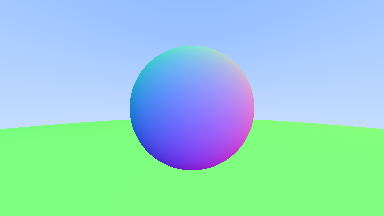

# Raytracing in one Weekend in Zig

Read the book at: 
https://raytracing.github.io/books/RayTracingInOneWeekend.html

## render the scene

```bash
$ zig build run && open out.ppm
```

## unit testing

```bash
$ zig build test --summary all
```

## convert the result to png

```bash
$ docker run -v $(pwd):/imgs dpokidov/imagemagick /imgs/out.ppm /imgs/current.png
```

## build options

```bash
$ zig build -Doptimize=ReleaseFast 
$ zig build -Doptimize=ReleaseSmall
```

## Benchmarking

```bash
$ hyperfine -N --warmup 3 './zig-out/bin/raytracing-zig'

Benchmark 1: ./zig-out/bin/raytracing-zig
  Time (mean ± σ):      55.7 ms ±   0.5 ms    [User: 48.3 ms, System: 7.1 ms]
  Range (min … max):    54.9 ms …  57.1 ms    53 runs
```

## Current rendering



## References
 
 * https://github.com/ryoppippi/Ray-Tracing-in-One-Weekend.zig
 * https://github.com/jpaquim/raytracing-zig